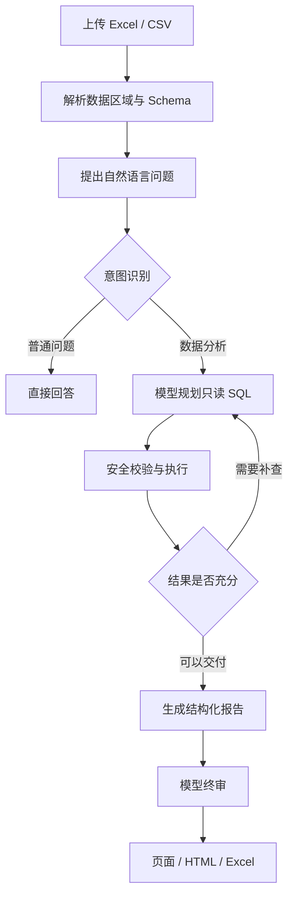

<div align="center">

# Veralyt

### 用自然语言分析表格，让结论有据可查。

Analytics you can verify.

[](https://github.com/3072074133-rgb/veralyt/actions/workflows/ci.yml)
[](LICENSE)
[](pyproject.toml)
[](web/package.json)

[快速开始](#快速开始) · [使用方式](#使用方式) · [模型配置](#模型配置) · [参与贡献](#参与贡献)

</div>

---

Veralyt 是一个本地优先、证据可追溯的表格分析智能体。上传 Excel 或 CSV，用自然语言描述问题，系统会规划查询、执行只读计算、核验结果并生成带证据引用的结构化报告。

项目面向财务和经营分析场景，既可使用本地 Ollama，也支持 DeepSeek、OpenAI、通义千问、Kimi 及其他 OpenAI 兼容服务。

## 可以用它做什么

| 场景 | 你可以提出的问题 |
| --- | --- |
| 财务分析 | 收入、利润与经营现金流之间有什么差异？哪些项目需要关注？ |
| 经营复盘 | 哪些业务、客户或费用项目对结果影响最大？ |
| 风险排查 | 哪些应收应付款存在逾期？结论对应哪些原始记录？ |
| 报告整理 | 按“核心结论 → 关键数据 → 问题与原因 → 行动建议”重组报告。 |

分析范围取决于上传数据。缺少对比期间、字段或业务背景时，需要补充数据或明确分析边界。

## 核心能力

### 从问题到计算

用自然语言提出目标，由模型规划只读 SQL、查询数据并按需补查。支持多工作表、多层合并表头，以及同一工作表中的多个数据区域。

### 从结论回到证据

通过报告中的证据入口查看关联记录与计算输入。SQL 执行经过语法树校验，并受任务数据范围、超时、内存与返回行数限制。

### 从分析到可交付报告

报告章节根据任务和用户要求组织，支持继续修改。页面、HTML 与 Excel 沿用相同的正文内容和章节顺序；正式结果可以发布到报告库。

### 本地保存，灵活选择模型

任务、文件、证据与报告保存在本机。数据修订形成新版本，历史分析保留原有数据版本；模型可以选择本地运行，也可以连接云端服务。

## 工作流程

<details>
<summary>展开查看：从上传表格到交付报告</summary>



详细的模块边界和设计原则见 [ARCHITECTURE.md](ARCHITECTURE.md)。

</details>

## 环境要求

| 依赖 | 要求 |
| --- | --- |
| Python | 3.13 或更高版本 |
| [uv](https://docs.astral.sh/uv/) | 用于安装和运行后端依赖 |
| Node.js / npm | Node.js 20+、npm 10+ |
| 模型服务 | 本地 [Ollama](https://ollama.com/) 或 OpenAI 兼容云端服务 |

默认模型为 `qwen3.5:4b`。低显存设备可以在 `.env` 中降低上下文容量。

## 快速开始

### Windows 一键启动

```powershell
git clone https://github.com/3072074133-rgb/veralyt.git
cd veralyt
Copy-Item .env.example .env
.\start.ps1
```

也可以双击 `start.cmd`。脚本会同步依赖、检查前端构建并打开 `http://127.0.0.1:8000`。

进入“模型设置”，选择供应商并填写模型信息。使用云端服务时无需安装 Ollama；本地模式需要先在 Ollama 中准备所选模型。

<details>
<summary>Windows 启动参数</summary>

```powershell
.\start.ps1 -NoBrowser
.\start.ps1 -Port 8001
.\start.ps1 -SkipBuild
```

</details>

<details>
<summary>手动启动 / Linux / macOS</summary>

安装后端和前端依赖：

```bash
git clone https://github.com/3072074133-rgb/veralyt.git
cd veralyt
cp .env.example .env
uv sync --dev
cd web
npm ci
cd ..
```

在第一个终端启动后端：

```bash
uv run uvicorn main:app --reload --host 127.0.0.1 --port 8000
```

在第二个终端中，从项目根目录启动前端：

```bash
cd web
npm run dev
```

前端开发地址为 `http://127.0.0.1:5173`，API 地址为 `http://127.0.0.1:8000`。

</details>

## 模型配置

启动后可以在“模型设置”中配置供应商、模型名称、Base URL、API Key、温度和最大输出长度。配置保存在本机 `data/model-settings.json`，API 只返回密钥掩码。

也可以复制 `.env.example` 为 `.env` 后编辑。为兼容早期版本，环境变量继续使用 `ANALYSE_AGENT_` 前缀：

```env
ANALYSE_AGENT_OLLAMA_HOST=http://127.0.0.1:11434
ANALYSE_AGENT_OLLAMA_MODEL=qwen3.5:4b
```

任务、文件、证据和报告默认保存在 `data/`。该目录、`.env`、日志和上传文件均已被 Git 忽略。

## 使用方式

可以使用仓库自带的[合成月度财务示例](tests/fixtures/monthly_financial_report.xlsx)体验完整流程。

1. 点击“新建分析”并上传 `.xlsx` 或 `.csv` 文件。
2. 在数据工作区确认字段、单位和数据范围。
3. 输入分析目标，例如“分析收入、利润和经营现金流的变化，并给出行动建议”。
4. 检查报告中的证据入口和风险说明。
5. 将正式结果发布到报告库，或导出 HTML、Excel。

修改数据会创建新的数据版本，并使旧的活动结果失效。修改报告会保留旧版本，再生成新的结构化结果。

**试试这个问题：**

> 请分析本月收入、利润和经营现金流之间的关系，识别值得关注的应收应付款与费用项目。所有结论应有数据依据，区分已证实事实和待验证原因，并按“核心结论 → 关键数据 → 问题与原因 → 行动建议”组织报告。

**继续修改报告：**

> 保留关键数据和证据，把报告改成适合管理层阅读的简短版本，并明确下一步需要核实的事项。

## 数据与隐私

- 本地 Ollama 模式下，表格和提示词不需要发送给第三方模型服务。
- 使用云端模型时，生成请求所需的数据上下文会发送给所配置的服务商。
- 系统不持久化模型思考过程、节点输入输出或完整提示词快照。
- 运行日志不记录原始单元格、知识正文或完整提示词。
- 删除数据集、任务或报告属于永久删除，界面会在执行前明确提示。

请勿使用未经授权的数据测试云端模型。提交 Issue 时不要附带真实报表、数据库、日志或访问凭据。

## 开发与验证

<details>
<summary>运行测试与构建</summary>

后端：

```bash
uv sync --dev
uv run pytest -q
uv run ruff check app tests
uv run pytest --cov=app --cov-report=term-missing -q
```

前端：

```bash
cd web
npm ci
npm test
npm run typecheck
npm run build
npm run test:e2e
```

日常测试默认跳过真实模型回归。已安装本地 Ollama 和指定模型后，可运行：

```bash
uv run pytest -m ollama --run-ollama -q
```

</details>

## 项目结构

<details>
<summary>展开项目目录</summary>

```text
veralyt/
├── app/                  # FastAPI、工作流、数据、报告与导出服务
├── prompts/              # 模型提示词与结构化输出约定
├── scripts/              # OpenAPI 和维护脚本
├── tests/                # 后端、工作流和真实模型回归测试
├── web/                  # Vue 3 前端及 Playwright 测试
├── ARCHITECTURE.md       # 架构边界
├── CONTRIBUTING.md       # 贡献指南
└── SECURITY.md           # 安全问题报告方式
```

</details>

## 当前限制

Veralyt 处于早期公开版本。模型输出仍可能有误，重要业务决策应结合报告中的证据和原始数据复核。

- 默认启动脚本主要针对 Windows；其他平台请使用手动启动方式。
- 当前输入格式为 Excel 和 CSV，尚未提供远程数据库连接器。
- 模型分析质量取决于数据质量、问题描述、模型能力和可用上下文。
- 真实模型回归需要单独准备 Ollama 服务，不在公共 CI 中运行。

## 路线图

- 提供 Linux/macOS 一键启动脚本和容器化部署
- 增加数据库连接器和更多文件格式
- 增加英文界面与英文文档
- 增加可复用的分析模板和评测数据集
- 完善性能基准与模型质量评测

## 参与贡献

欢迎通过 [Issue](https://github.com/3072074133-rgb/veralyt/issues) 反馈问题或提出建议，也欢迎提交 Pull Request。

- 开始开发：[贡献指南](CONTRIBUTING.md)
- 社区约定：[行为准则](CODE_OF_CONDUCT.md)
- 安全问题：[安全政策](SECURITY.md)，请按文档中的方式私下报告
- 版本变化：[更新记录](CHANGELOG.md)

## 许可证

Veralyt 使用 [MIT License](LICENSE)。
